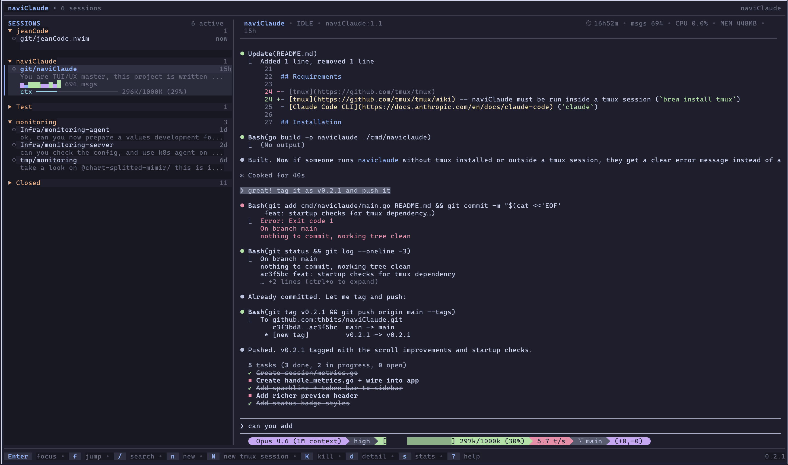

# naviClaude

TUI for managing Claude Code sessions across tmux sessions.



## Features

- **Session sidebar** -- lists active and recently closed Claude Code sessions, grouped by project
- **Live preview** -- real-time tmux pane capture of the selected session
- **Activity sparklines** -- per-session message activity visualization on the selected item
- **Context usage bar** -- shows current token usage vs context window limit
- **Breathing status dots** -- active sessions pulse green, waiting sessions pulse amber
- **Passthrough mode** -- type directly into a session without leaving the TUI
- **Fuzzy search** -- filter sessions by name
- **Session management** -- create new sessions, kill existing ones, resume in the current pane
- **Detail popup** -- view session metadata (model, project, cost, token counts)
- **Rich preview header** -- status badge, uptime, message count, CPU/memory
- **Usage statistics** -- per-project breakdown with bar charts
- **10 built-in color themes** with a live theme picker
- **Configurable key bindings** and layout options
- **Auto-collapse** -- idle project groups collapse automatically

## Requirements

- [tmux](https://github.com/tmux/tmux/wiki) -- naviClaude must be run inside a tmux session (`brew install tmux`)
- [Claude Code CLI](https://docs.anthropic.com/en/docs/claude-code) (`claude`)

## Installation

### Homebrew

```
brew install thbits/tap/naviclaude
```

### Manual

```
git clone https://github.com/thbits/naviClaude.git
cd naviClaude
make install
```

This installs the binary to `~/.local/bin/naviclaude`. Set a custom prefix with `PREFIX=/usr/local make install`.

### Run as a tmux popup

```
tmux display-popup -E -w 85% -h 85% naviclaude
```

## Usage

Launch naviClaude from any terminal inside tmux:

```
naviclaude
```

### Key bindings

| Key | Action |
|---|---|
| `j` / `k` | Navigate sessions |
| `Enter` / `Tab` | Focus session (passthrough mode) |
| `Tab` / `Shift+Tab` / `Ctrl+]` | Exit passthrough mode |
| `f` | Jump to pane |
| `Ctrl+F` | Jump to pane (from passthrough) |
| `/` | Search |
| `n` | New session (same tmux session) |
| `N` | New tmux session (prompts for name) |
| `K` | Kill session |
| `d` | Detail popup |
| `s` | Statistics popup |
| `T` | Theme picker |
| `Ctrl+U` / `Ctrl+D` | Scroll preview |
| `?` | Help overlay |
| `q` | Quit |

All key bindings except navigation and passthrough exit keys are configurable.

## Configuration

Config file location: `~/.config/naviclaude/config.yaml`

naviClaude creates this file automatically when you save a theme. All fields are optional -- missing fields use defaults.

```yaml
keys:
  quit: "q"
  search: "/"
  focus: "enter"
  jump: "f"
  new_session: "n"
  new_tmux_session: "N"
  kill_session: "K"
  detail: "d"
  stats: "s"
  help: "?"

sidebar_width: 30
refresh_interval: "200ms"
closed_session_hours: 6
popup_width: 85
popup_height: 85
resume_in_current_session: true
process_names: ["claude"]
collapse_after_hours: 8
active_window_secs: 5
theme: "tokyo-night"
claude_command: "claude"
# new_session_dir: "~/projects"
```

| Option | Default | Description |
|---|---|---|
| `sidebar_width` | `30` | Width of the session list panel |
| `refresh_interval` | `200ms` | How often to refresh session data |
| `closed_session_hours` | `6` | Show closed sessions from the last N hours |
| `popup_width` | `85` | Popup width (percentage of terminal) |
| `popup_height` | `85` | Popup height (percentage of terminal) |
| `resume_in_current_session` | `true` | Resume sessions in the current tmux pane |
| `process_names` | `["claude"]` | Process names to detect as Claude sessions |
| `collapse_after_hours` | `8` | Auto-collapse groups idle longer than N hours (0 to disable) |
| `active_window_secs` | `5` | Seconds after last activity to consider a session active |
| `theme` | `tokyo-night` | Color theme name |
| `claude_command` | `claude` | Command to start Claude (sent via send-keys, supports aliases) |
| `new_session_dir` | `~` | Working directory for new tmux sessions created with `N` |

## Themes

Available built-in themes:

- `catppuccin-latte`
- `catppuccin-mocha`
- `dracula`
- `gruvbox`
- `kanagawa`
- `nord`
- `one-dark`
- `rose-pine`
- `solarized-dark`
- `tokyo-night` (default)

Press `T` to open the theme picker with live color swatches. Selected themes are saved to the config file.

## License

MIT
